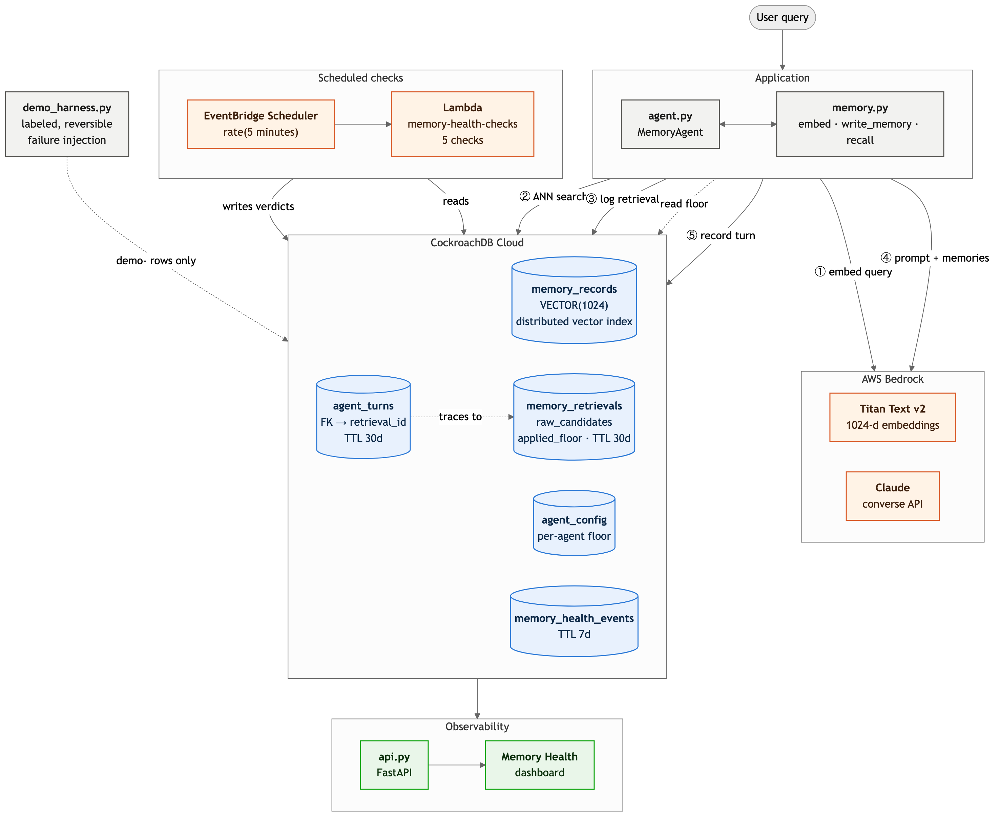
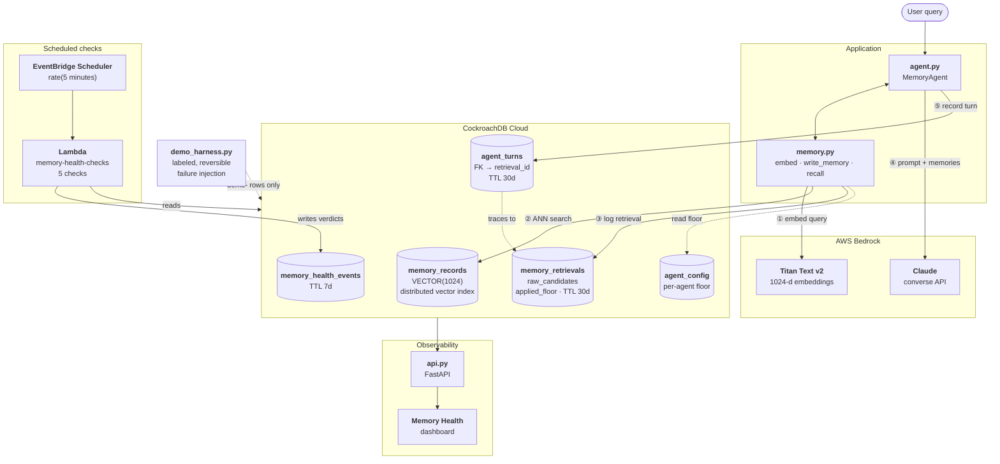

# Agent Memory Observability

**Agent memory fails silently. This makes the failure visible before the agent
starts giving bad answers.**

A CockroachDB-backed memory layer for AI agents, five health checks that run on
a schedule, and a dashboard that refuses to say "healthy" unless it has evidence.

---

## Live demo

**→ https://agent-memory-health.onrender.com**

The deployed dashboard is **read-only**. Every route is `GET`, and `api.py`
holds its database session `read_only`, so CockroachDB refuses any write, DDL
included — the injection and reset verbs in `demo_harness.py` are local-only and
are not reachable from the web service.

**The failures shown there are injected on purpose.** The `demo-` agents are
driven by `demo_harness.py`, which injects real, reversible failures so the
checks have something true to catch. Red and amber mean the tool is working; a
green board would mean nothing had been tested. The dashboard says so in a
banner at the top.

**The demo refreshes itself.** Every check reads a 60-minute window, so a
failure injected once is invisible an hour later — and a visitor arriving at an
arbitrary time would find a green board sitting under a banner promising
injected failures. A second Lambda, `memory-demo-injector`, re-runs the two
retrieval injections every 30 minutes so the live window is populated whenever
anyone looks. See [Keeping the demo populated](#keeping-the-demo-populated).

If you do catch it green, that is the design working rather than failing: the
checks are reporting a quiet window honestly instead of holding a stale alarm.
The 24-hour strips under each panel carry the history the current verdict
cannot.

Two things to expect on a free-tier instance: the first request after ~15
minutes of inactivity takes **up to a minute** while the service cold-starts,
and the overall verdict reads whatever the memory *actually* is.

The frontend degrades per-panel rather than all-or-nothing. Each feed is fetched
independently (`Promise.allSettled`, one retry with backoff); a feed that fails
marks *its own* card stale and leaves the rest live, and the "cannot reach the
API" state appears only when every feed fails. An earlier version used
`Promise.all`, so a single transient 404 during cold start discarded six good
responses and blanked the whole board — the opposite of the per-signal honesty
the checks themselves are built on.

<details>
<summary>Deploying it yourself</summary>

The repo ships a `render.yaml` blueprint. In Render: **New → Blueprint →**
select this repo. The only thing to set by hand is `DATABASE_URL` (marked
`sync: false`, so it is never stored in the repo). The CockroachDB CA is
bundled at `certs/cockroachdb-root.crt` and resolved automatically, because a
deployed container has no `~/.postgresql/root.crt`.

`healthCheckPath` points at `/healthz` — liveness only, deliberately not
`/api/health/current`. Wiring platform restarts to the memory-health endpoint
would bounce the service every time the checker fell behind, which fixes
nothing.
</details>

## The problem

When a database goes down you get an exception. When agent memory degrades you
get a confident, fluent, ungrounded answer — and nothing anywhere reports an
error.

Four ways it happens, none of which raise:

- A retrieval returns nothing, and the agent answers from parametric knowledge
  as if it had never had a memory at all.
- A record is written with a fresh `written_at` but carries a fact that was true
  a week ago. Everything downstream treats it as current.
- The corpus is about to evict half of itself. Every query still succeeds, right
  up until it doesn't.
- The embedding pipeline writes a null or un-normalised vector. The row is
  there, the query runs, the row is simply never retrieved again.

The usual response is to monitor the database — connections, latency, CPU. All
of those are green in every one of the cases above. The failure isn't in the
infrastructure; it's in whether the memory still *means* anything. That is what
this project instruments.

The hardest case is the one this project is named for: **a retrieval that
returns nothing is not one failure, it's two.** `raw_candidates = 0` means the
corpus had nothing — a data problem. `raw_candidates > 0, results_returned = 0`
means the search found rows and the similarity floor discarded them — a config
problem. They look identical in every log. They have opposite fixes. This layer
separates them, and it caught a real instance of the second one in its own
default configuration (see the [case study](#case-study-the-layer-caught-its-own-miscalibration)).

---

## Architecture



<details>
<summary>Same diagram as mermaid (source: <code>docs/architecture.mmd</code>)</summary>


</details>

| File | What it is |
|---|---|
| `schema.sql` | All five tables, the vector index, and the TTL policies |
| `memory.py` | `embed()` · `write_memory()` · `recall()` — the memory layer |
| `agent.py` | `MemoryAgent` — recall → Bedrock → answer → write back |
| `checks.py` | The five health checks, `run_all()`, and the Lambda handler |
| `api.py` | Read-only FastAPI backend for the dashboard |
| `static/index.html` | The dashboard — single page, no build step |
| `demo_harness.py` | Labeled, reversible failure injection and the demo driver |
| `demo_injector.py` | Scheduled Lambda that keeps the demo populated (30-min refresh) |
| `scripts/` | `apply_schema.py`, `deploy_lambda.sh`, `deploy_demo_injector.sh` |

**The link that makes it work:** every `recall()` writes a `memory_retrievals`
row, and every agent turn writes an `agent_turns` row carrying that retrieval's
id as a foreign key. A bad answer is therefore never a mystery — it resolves to
the exact retrieval that produced it, with the raw candidate count, top
similarity, and applied floor attached.

---

## The five checks

Each writes one row to `memory_health_events` per run. **A check that finds
nothing still writes an `ok` row** — the absence of a health record must never
be readable as health.

| Check | Catches | Fires when |
|---|---|---|
| `staleness` | Rows that *look* fresh but carry an old fact | `written_at` is recent while `effective_as_of` is older than 24h. Nothing reading `written_at` would ever suspect these. |
| `eviction_pressure` | A corpus about to lose a large share of itself | Rows expiring within 60 minutes cross 10% (warn) / 25% (critical) of live rows. Every query still succeeds while this fires — that's the point. |
| `empty_resolve` | Retrievals that found candidates and returned none | `results_returned = 0` with `raw_candidates > 0`. The memory is present and no longer relevant. Silent by construction: no error, no retry, just an agent that forgot. |
| `near_miss` | Relevant results the floor threw away | A floored-out retrieval whose `top_similarity` sits within 0.15 *below* the applied floor. `empty_resolve` says "nothing was relevant"; this says "something was, and policy discarded it." Different problem, different fix. |
| `vector_drift` | Embeddings that are missing, mis-sized, or un-normalised | Null embeddings, wrong dimension, or L2 norm outside 1.0 ± 0.05. Titan v2 returns unit vectors, so a norm far from 1.0 means something wrote a bad one. |

`near_miss` also computes a **suggested floor** — the midpoint between the
highest rejected-but-relevant score and the highest clearly-off-topic score in
the window — and labels it advisory. It is never auto-applied: moving a
retrieval floor changes what every future query returns, and that is a human
decision.

Severity is `ok` / `warn` / `critical`, and the dashboard's overall verdict
degrades if any check degrades. Critically, it reads **`unknown` — never
`healthy`** — when no health row has been written inside a 15-minute freshness
window, or when the browser cannot reach the API. Stale health data is a failure
state, not a green light.

---

## CockroachDB features used

### Distributed Vector Index

`memory_records.embedding` is a native `VECTOR(1024)` column with a distributed
vector index:

```sql
embedding VECTOR(1024),
...
CREATE VECTOR INDEX ON memory_records (embedding);
```

`recall()` orders by the `<->` (L2) operator so the index is actually used,
then converts distance to cosine similarity (`1 - d²/2`, valid because Titan v2
returns unit vectors). Filtering by `agent_id` and expiry happens in the same
query — the vector search and the relational predicates are one statement
against one system, with no separate vector store to keep in sync.

The index is what makes the whole observability story possible: because
retrieval is a normal SQL query, the retrieval log, the health events, the agent
turns, and the vectors all live in the same database and can be joined. The
`agent_turns → memory_retrievals` foreign key is a plain FK.

### Cloud Managed MCP Server

Used throughout development for cluster introspection and schema work:
`list_clusters`, `list_databases`, `list_tables`, `get_table_schema`,
`select_query`, and `create_table`. It is how the tables were first created and
how schema changes were verified afterward.

**Two limits worth documenting**, both discovered by hitting them:

- Its write surface is `CREATE TABLE` and `INSERT` only. `ALTER TABLE`, `DROP`,
  and `RENAME` are rejected, so migrations (adding `raw_candidates`,
  `applied_floor`, the TTL policies) go through psycopg over `DATABASE_URL`
  instead. Verification still runs through MCP's `get_table_schema`.
- Tables it creates come out **without** `schema_locked = true`, while a plain
  `CREATE TABLE` over SQL gets it. That matters: a locked table rejects
  `ALTER TABLE ... ADD COLUMN` until unlocked, so a cluster rebuilt from
  `schema.sql` behaves differently from one built through MCP.

### Agent Skills

**Not used.** No CockroachDB Agent Skill is invoked anywhere in this codebase,
and the README will not claim otherwise. The natural fit would be packaging the
five checks and the `demo_harness` verbs as a skill so an agent could run and
interpret them conversationally ("is my memory healthy?", "why did that answer
have no context?") rather than through the CLI and dashboard. That is the
obvious next piece of work, not something already built.

### Row-level TTL

The observability tables prune themselves — no cleanup job:

| Table | `ttl_expire_after` | Why |
|---|---|---|
| `memory_health_events` | 7 days | 4 rows every 5 minutes ≈ 34.5k rows/month. Longer trends belong in a metrics store. |
| `memory_retrievals` | 30 days | Enough for the 24h dashboard and month-over-month comparison. |
| `agent_turns` | 30 days | Matches the retrievals it references. |

`memory_records` deliberately has **no** TTL. Its `expires_at` is
application-level eviction policy that the memory layer reads and
`eviction_pressure` reports on; hard-deleting those rows would destroy the
"what did this agent forget, and when" signal.

---

## AWS services used

### Bedrock

- **Titan Text v2** (`amazon.titan-embed-text-v2:0`) via `invoke_model`,
  1024 dimensions, `normalize: true`. The normalization is load-bearing — the
  distance-to-similarity conversion and `vector_drift`'s norm check both assume
  unit vectors.
- **Claude** via `converse` for the agent's reasoning, plus a cheaper model for
  the write-back fact extraction (a small mechanical job that doesn't need the
  larger model). Both configurable by env var.

### Lambda

`checks.py` doubles as a Lambda handler (`checks.lambda_handler`) — python3.12,
x86_64, 512 MB, 60s. `run_all()` is the same code path the CLI uses, so the
scheduled checks and a local run cannot drift apart.

**Three packaging requirements**, all learned the hard way:

1. Build with Linux wheels (`--platform manylinux2014_x86_64 --only-binary=:all:`)
   or you ship macOS arm64 binaries that fail at import.
2. **Bundle the CockroachDB CA.** The connection string uses
   `sslmode=verify-full` with no `sslrootcert`, so psycopg looks for
   `~/.postgresql/root.crt` — present locally, absent in Lambda. Setting
   `sslrootcert=system` does *not* fix it: psycopg's bundled libpq cannot
   resolve Amazon Linux's trust store and fails with `certificate verify failed`.
   Ship `root.crt` in the zip and point `sslrootcert=/var/task/root.crt`.
   TLS verification stays at `verify-full` — this is not a downgrade.

`demo_injector.py` is a **second** Lambda (`memory-demo-injector`) — python3.12,
x86_64, 512 MB, 180s — covered in
[Keeping the demo populated](#keeping-the-demo-populated). It is deliberately a
separate function with its own role: the checker only ever reads, the injector
writes, and nothing that needs to read should inherit the ability to write.

3. **Name `typing-extensions` explicitly.** psycopg imports it at module load on
   any Python below 3.13 (`psycopg/_compat.py`), but pip does not resolve it as
   a dependency under `--python-version 3.12`. Omit it and you get a package
   that imports cleanly on the host and dies in Lambda with
   `No module named 'typing_extensions'`. Both deploy scripts pin it.

### EventBridge Scheduler

A `rate(5 minutes)` schedule invokes the checks via a scoped role that can call
`lambda:InvokeFunction` on that one function, and a `rate(30 minutes)` schedule
invokes the injector the same way. `scripts/deploy_lambda.sh` and
`scripts/deploy_demo_injector.sh` create all of it.

Note the IAM shape: `AWSLambda_FullAccess` grants **no** EventBridge access, so
the deploying principal needs `scheduler:CreateSchedule` (and `iam:PassRole`
scoped to the scheduler role) added separately.

---

## Setup from a clean machine

### Prerequisites

- **Python 3.11+** (3.12 recommended — that's what this was built and pinned against)
- **git**
- A **CockroachDB Cloud** account ([free tier](https://cockroachlabs.cloud/signup) is enough)
- An **AWS account** with Bedrock access in `us-east-1`

### 1. Clone and create the environment

```sh
git clone https://github.com/sslone04/agent-memory-obs.git
cd agent-memory-obs

python3.12 -m venv .venv
./.venv/bin/pip install -r requirements.txt
```

### 2. Create the CockroachDB cluster

1. In the [CockroachDB Cloud console](https://cockroachlabs.cloud), create a
   cluster (Basic is fine).
2. **Connect → General connection string** — copy it.
3. Download the cluster CA to `~/.postgresql/root.crt` (the console gives you the
   exact `curl`). Needed locally *and* by the Lambda deploy script.

```sh
cp .env.example .env
# edit .env and paste your connection string into DATABASE_URL
```

`.env` is gitignored and blocked by the pre-commit hook. Nothing else in this
repo needs a secret.

### 3. Apply the schema

```sh
./.venv/bin/python scripts/apply_schema.py
./.venv/bin/python scripts/apply_schema.py --check   # verify
```

### 4. Enable Bedrock models

In the AWS console → Bedrock → **Model access** (region `us-east-1`), request:

- **Amazon Titan Text Embeddings V2** — required. Everything except the agent
  depends on it.
- **Anthropic Claude** — required only for `agent.py` and `demo_harness.py story`.
  Anthropic models additionally require a one-time **use case details form** per
  account. Until it is submitted, every call fails with
  `ResourceNotFoundException: Model use case details have not been submitted`.
  `agent.py` catches this and tells you the remedy rather than dumping a
  traceback.

Credentials come from the standard chain (`aws configure`, env vars, or an
instance role).

### 5. Verify

```sh
./.venv/bin/python memory.py     # writes memories, recalls them, asserts telemetry
./.venv/bin/python checks.py     # runs all five checks, human-readable output
```

`memory.py`'s smoke test is the real end-to-end check: it embeds, writes,
retrieves, verifies the access counters incremented, and confirms the retrieval
log recorded both the raw and filtered counts.

### 6. Run the dashboard

```sh
./.venv/bin/python -m uvicorn api:app --port 8000
```

→ **http://127.0.0.1:8000**

### 7. (Optional) Deploy the scheduled checks

```sh
./scripts/deploy_lambda.sh
```

Creates the IAM roles, packages with Linux wheels, bundles the CA, deploys the
function, and puts it on a 5-minute schedule. Re-run to update.

> **Cost note:** the 5-minute schedule runs ~8,640 times/month. Lambda cost is
> pennies, but each run opens a CockroachDB connection and writes 5 rows. Pause
> with `aws scheduler update-schedule --name memory-health-checks-every-5min --state DISABLED`.

---

## Keeping the demo populated

Judging runs for days and nobody controls when a judge opens the dashboard. The
five checks each read a **60-minute** window, so a failure injected by hand is
gone from every panel an hour later. Without something to refresh it, most
arrivals would land on a green board underneath a banner insisting the failures
are deliberate — the one reading that makes the whole project look broken.

`demo_injector.py` closes that gap. It runs as its own Lambda on a
`rate(30 minutes)` schedule and, on each run:

1. **Prunes** `demo-` rows older than 24h.
2. **Tops up the healthy baseline** — four on-topic recalls, and the corpus
   itself if it is missing.
3. **Injects `near_miss`**, then **`degradation`** — the same
   `inject_near_miss()` and `inject_degradation()` the CLI calls. It imports
   them from `demo_harness.py` rather than restating them, so there is exactly
   one definition of what a near miss is and the scheduled demo cannot drift
   from the one you run locally.

The healthy recalls in step 2 are not part of the two injections. They are there
because after a prune the only demo retrievals left inside the window would be
failures, and the calibration histogram needs the returned-to-agent cluster to
make the discarded ones legible as a *separate mode* rather than as all the data
there is.

```sh
./scripts/deploy_demo_injector.sh                       # deploy or update
aws lambda invoke --function-name memory-demo-injector \
  --region us-east-1 /dev/stdout                        # run it once, now
```

### Why it cannot touch anything real

Four independent guards, in the order they apply:

| Guard | What it prevents |
|---|---|
| `require_demo()` | Any write whose `agent_id` lacks the `demo-` prefix raises before a statement runs. |
| `protected_counts()` / `assert_untouched()` | Non-demo row counts are snapshotted across all five tables before and after every run. One changed row aborts it. |
| Predicated DELETEs | Every statement the pruner issues carries `agent_id LIKE 'demo-%'`. |
| Its own IAM role | Separate from the checker's. Its only non-logging grant is `bedrock:InvokeModel` on the single Titan embedding model. |

The dashboard is unaffected by any of this: `api.py` still holds its session
`read_only`, so the web service cannot write regardless of what the injector
does.

Errors are redacted before they reach CloudWatch. psycopg quotes the connection
string in its exception messages, so `lambda_handler` rewrites any
`postgres://…` it finds before re-raising.

### Bounding the growth

48 runs a day at ~23 retrievals each is ~1,100 rows a day, which would grow
without end over a judging period.

**The choice made here is an age bound, not a row cap:** each run first deletes
`demo-` rows older than **24 hours** from `memory_retrievals`, `agent_turns`
and `memory_health_events`. 24h is not arbitrary — it is the widest window any
panel on the dashboard reads, so a demo row older than that is already invisible
everywhere and costs only storage. Steady state is a function of the schedule
(~1,100 retrievals) rather than of how long judging happens to run.

A row cap was the alternative and is worse here: it has to decide *which* rows
to drop, and dropping the oldest would quietly delete points out from under the
24-hour charts mid-window.

Two things the pruner deliberately does not do:

- **`memory_records` is never pruned.** It is the corpus the injections retrieve
  *against*. Delete it and every near miss becomes an empty-corpus miss, which
  is the other failure class entirely.
- **A retrieval is kept while any `agent_turn` still references it.** The
  foreign key is `ON DELETE SET NULL`, so pruning a referenced retrieval would
  silently break the turn → retrieval trace the Agent impact panel is built on.

### Pausing it

The demo refresh is the one scheduled thing that writes. To stop it:

```sh
aws scheduler update-schedule --name memory-demo-injector-every-30min \
  --region us-east-1 --state DISABLED \
  --schedule-expression 'rate(30 minutes)' \
  --flexible-time-window '{"Mode":"OFF"}' \
  --target '{"Arn":"arn:aws:lambda:us-east-1:<account>:function:memory-demo-injector",
             "RoleArn":"arn:aws:iam::<account>:role/memory-demo-injector-scheduler-role"}'
```

`demo_harness.py reset --yes` removes every `demo-` row afterwards.

---

## Demo path

`demo_harness.py` is the demo driver and the failure-injection rig. Nothing it
produces is simulated — the records, embeddings, similarity scores, and floor
decisions all come from the same code paths production uses. The only staged
part is *which* data goes in.

**Every row it writes carries an `agent_id` prefixed `demo-`.** Two guards
enforce it: `require_demo()` rejects any other agent id, and every destructive
phase snapshots non-demo row counts before and after, aborting if they moved.

```sh
./.venv/bin/python demo_harness.py story                # the whole arc, one command
./.venv/bin/python demo_harness.py seed                 # corpus + healthy baseline
./.venv/bin/python demo_harness.py inject near_miss     # the calibration failure
./.venv/bin/python demo_harness.py inject degradation   # real off-topic retrievals
./.venv/bin/python demo_harness.py heal near_miss       # apply the suggested floor
./.venv/bin/python demo_harness.py reset --yes          # remove every demo- row
```

Add `--pause` to any command to stop before each phase, for narrating over.

**`story` is the one to run.** Five phases, each printing the agent's actual
answer next to the retrieval telemetry that produced it:

1. **Seed** — corpus written, healthy baseline established.
2. **Healthy** — the agent answers *"which database are we running in
   production?"* from memory, and the turn records which records fed it.
3. **Warning** — those exact records get an `expires_at` 45 minutes out. They're
   still live, so the answer is still correct — but `eviction_pressure` fires
   **now**. The health signal moves before the behavior does.
4. **Failure** — the records expire. `recall()` filters expired rows, the same
   question retrieves nothing above the floor, and the agent answers without
   context. Nothing errors.
5. **Heal** — `expires_at` cleared. Same question, same model; only the memory
   changed.

`story` uses targeted eviction rather than off-topic query injection, because
off-topic injection cannot make a *specific* question degrade — it only adds
unrelated failing retrievals. To show the same question breaking, the memory it
depends on has to genuinely become unavailable.

| Mode | What actually happens |
|---|---|
| `seed` | 14 records with real Titan embeddings, then 10 real `recall()` calls that all clear the floor |
| `inject stale` | Records with `effective_as_of` backdated 3 days, `written_at` left at `now()` |
| `inject eviction` | Records with `expires_at` inside the 60-minute pressure window |
| `inject degradation` | Real `recall()` calls with off-topic queries — `raw_candidates > 0`, everything floors out |
| `inject near_miss` | Real `recall()` calls measured to land 0.20–0.35; each retrieves the *correct* record and is rejected anyway |
| `inject drift` | One NULL-embedding record, one non-unit-norm record |
| `heal [failure]` | Reverses the condition; `near_miss` applies the suggested floor to `agent_config` |
| `timeline --hours 6` | Spreads a healthy → degrading → recovering arc across the window so the 24h charts show the shape |
| `reset` | `DELETE ... WHERE agent_id LIKE 'demo-%'` across every table |

Two honest caveats: `timeline` rewrites `retrieved_at` on demo rows so a
compressed run doesn't land in one chart bucket (the scores are real, the
timestamps are staged), and `inject drift` **cannot** produce a wrong-dimension
row — the column is `VECTOR(1024)` and the database refuses. The harness
attempts it anyway and reports the refusal, because "`wrong_dim` is always 0"
should be verified rather than assumed.

---

## Case study: the layer caught its own miscalibration

While building the demo corpus, the first "healthy" baseline came back **25%
degraded before anything was injected**. Rather than adjusting until it looked
right, every query was scored against the corpus:

| Query | Nearest record | Score | At floor 0.35 |
|---|---|---|---|
| `which database are we running in production?` | *"The production database is CockroachDB v26.2…"* | **0.698** | returned |
| `what is the similarity floor for retrieval?` | *"Retrieval applies a cosine similarity floor…"* | **0.686** | returned |
| `what timezone does the user work in?` | *"The user works in Pacific time…"* | **0.358** | barely returned |
| `how often do the health checks run?` | *"The memory health checks run as a Lambda…"* | **0.323** | ✗ **rejected** |
| `what happened during the June incident?` | *"On 12 June the embedding pipeline wrote null vectors…"* | **0.226** | ✗ **rejected** |

Each rejected query retrieves the **semantically correct record** and is thrown
away by the floor. These are false negatives, not misses.

The `near_miss` check found them without being told where to look:

```
[    WARN]  near_miss
           floored_out_total: 19          near_miss: 9  (47.37%)
           clear_miss: 10
           near_miss_scores: [0.3234, 0.3226, 0.3149, 0.2822, 0.2764,
                              0.2674, 0.2505, 0.2283, 0.2263]
           max_near_miss: 0.3234          max_clear_miss: 0.1141
           suggested_floor: 0.2188
```

It separated 9 false negatives from 10 genuine misses in the same window, and
suggested **0.2188** — the midpoint between the best rejected-but-relevant score
(0.3234) and the best clearly-off-topic score (0.1141). That value lands in the
empty valley of a genuinely bimodal distribution: nothing at all scores between
0.143 and 0.214. Applying it returned all 9 false negatives while still
excluding every off-topic query — verified, not asserted: **0/9 → 9/9**.

`DEFAULT_MIN_SIMILARITY` is deliberately still 0.35. The default staying wrong
is what proves the check works; tune per agent via `agent_config` instead.

The takeaway generalizes past this repo. Titan v2 cosine scores for a
natural-language *question* against a declarative *statement* run lower than
intuition suggests, so a floor picked by feel will silently discard correct
answers — and every one of those looks identical to "we had nothing" in the
logs.

---

## Note: `now()` is the transaction timestamp in CockroachDB

`now()` returns the **transaction** timestamp, not the statement clock. Every
row inserted inside one transaction gets a byte-identical value.

Observed directly here: four health events written by one `run_all()` all landed
at `2026-08-08T04:51:36.064357Z`, and three retrievals written in one
transaction came back from `ORDER BY retrieved_at` in the wrong order.

Consequences, both of which bit this codebase:

- **You cannot recover intra-batch write order** from `retrieved_at` or
  `observed_at`. Time-ordered analysis across rows written together is wrong,
  silently.
- **You cannot identify the row you just inserted** by timestamp.
  `ORDER BY retrieved_at DESC LIMIT 1` returns an arbitrary row from the same
  transaction. `recall()` therefore takes a `stats` dict and returns the
  retrieval id via `RETURNING id` — which is also the only way a caller can
  learn how close a floored-out retrieval came, since it returns `[]`.

Use `clock_timestamp()` if intra-transaction ordering matters. This project keeps
`now()` (the events are logically simultaneous) and returns ids explicitly.

---

## Known gaps

Honest list of what a stranger will hit:

- **Bedrock Anthropic access requires a manual form** that cannot be scripted.
  Everything except `agent.py` and `demo_harness.py story` works without it.
- **No CockroachDB Agent Skill** — see above; the checks are CLI + dashboard only.
- **No automated test suite.** `memory.py` and `demo_harness.py` self-verify with
  assertions, and there's an empty-table safety test, but there is no `pytest`
  suite or CI.
- **Dashboard is local-only** — `uvicorn` on `127.0.0.1`, no auth, no deployment.
  It is read-only and takes no user input, but it is not hardened for exposure.
- **Single-region, single-cluster.** No multi-region validation despite
  CockroachDB being the obvious database for it.

---

## License

[Apache License 2.0](LICENSE) — Copyright 2026 Sam S.
